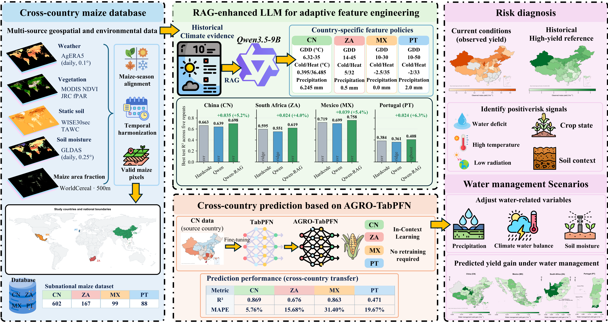

# CY-Bench 三阶段农业 AI 框架



本项目研究结构化气候 RAG 特征工程、TabPFN 跨国家产量预测，以及有证据约束的农业风险诊断与建议。

## 主流程

### Stage 1：Base Qwen + 结构化气候 RAG

Stage 1 直接查询 `Climate_rag_knowledge_base/processed/climate_rag_metrics.csv`。检索器先按作物、国家和校准截止年份过滤，再选择典型、热旱、冷湿和长干旱历史年份。它不创建 embedding，也不使用向量数据库。

Base Qwen3.5-9B 综合以下证据生成候选特征参数：

- 目标国家校准期的生长季气候画像；
- 校准期胁迫—产量残差证据；
- CSV 检索得到的历史气候型及统计摘要。

候选配置只在校准年份上筛选，最终外层测试年份不会参与检索或参数选择。评估模型包括 Ridge、XGBoost、SVR、CNN1D 和 TransformerFlat。

```powershell
conda run -n specllm python -m cybench.stages.stage1_feature_engineering.prepare --regenerate-llm
conda run -n specllm python -m cybench.stages.stage1_feature_engineering.run --repeats 5
conda run -n specllm python -m cybench.stages.stage1_feature_engineering.summarize
```

### Stage 2：TabPFN 跨国家预测

Stage 2 固定读取 Stage 1 的 `qwen_rag/feature_dataset.csv`，比较原始 TabPFN 与使用 CN 数据继续训练的 TabPFN。CN 使用严格留出的 2020–2022 年；其他国家采用最后 30% 年份的前向时间测试。

```powershell
conda run -n specllm python -m cybench.stages.stage2_tabpfn_transfer.prepare_cn_data
conda run -n specllm python -m cybench.stages.stage2_tabpfn_transfer.run --repeats 5
```

### Stage 3：风险诊断与条件性建议

Stage 3 读取同一套 RAG 特征和 Stage 2 预测，拟合产量响应代理模型，识别高风险地区，并生成受动作白名单和证据字段约束的建议。Base Qwen 与结构化 RAG 分支使用同一基础模型，区别仅在于是否注入校准期历史气候检索证据。

```powershell
conda run -n specllm python -m cybench.stages.stage3_advisory.run --repeats 5
```

## 五次重复协议

所有预测模型默认运行 5 次，seed 为 `42 + 1009 × (repeat-1)`。逐样本预测文件同时保存 `train/test`、`repeat` 和 `seed`。指标文件包括逐次结果以及均值、样本方差。Ridge、SVR 等确定性算法出现方差 0 属于正常结果。

## 主要目录

```text
Climate_rag_knowledge_base/
  processed/climate_rag_metrics.csv
  raw/nasa_power/
LLM/Qwen3.5-9B/
tabpfn_3/
cybench/stages/
  stage1_feature_engineering/
  stage2_tabpfn_transfer/
  stage3_advisory/
cybench/output/
```

每个正式 CSV 都有相邻的 `.manifest.json`，记录数据身份、来源 SHA-256、模型、年份边界和实验参数。

## 测试

```powershell
conda run -n specllm python -m pytest tests/stages -q
```

